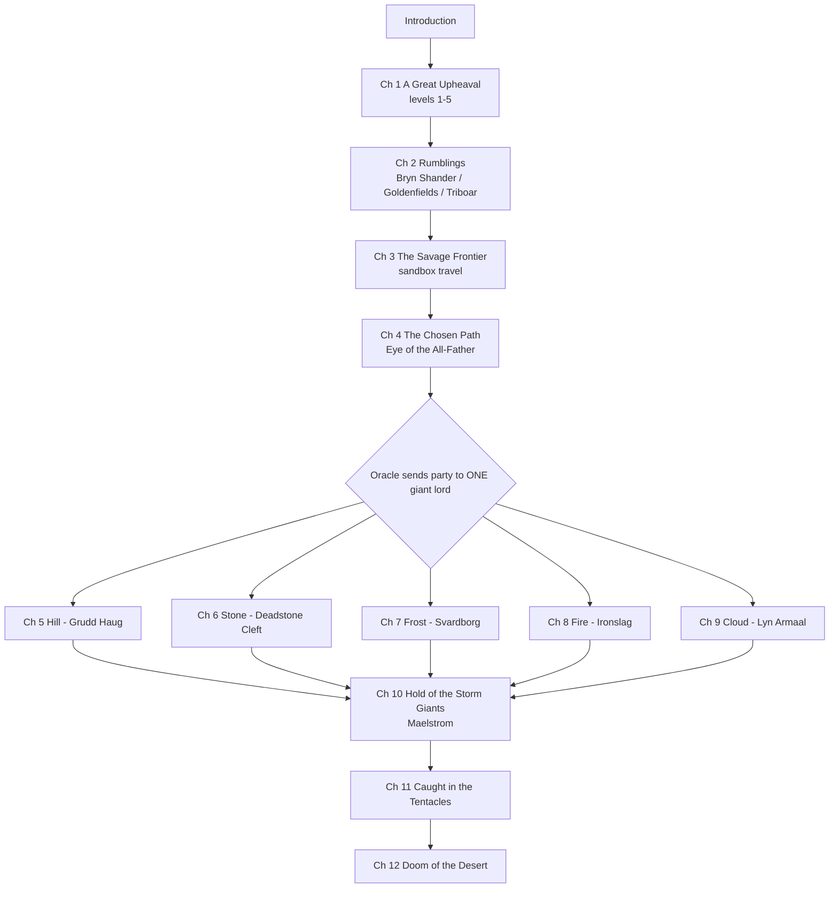

# Adventure Flow

This is a simplified version of the book's own [[Storm Kings Thunder.pdf#page=18|flowchart (p. 17)]]. Obsidian draws the diagram below automatically.

## Levelling
Your table uses **XP or milestones, as written**, and characters level up **only during a long or short rest**.
The book gives a milestone level-up in each chapter's *Character Advancement* sidebar:

| Chapter | Sidebar |
|---|---|
| [[Ch 01 - A Great Upheaval]] | [[Storm Kings Thunder.pdf#page=37\|p. 36]] |
| [[Ch 02 - Rumblings]] | [[Storm Kings Thunder.pdf#page=63\|p. 62]] |
| [[Ch 04 - The Chosen Path]] | [[Storm Kings Thunder.pdf#page=137\|p. 136]] |
| [[Ch 05 - Den of the Hill Giants]] | [[Storm Kings Thunder.pdf#page=145\|p. 144]] |
| [[Ch 06 - Canyon of the Stone Giants]] | [[Storm Kings Thunder.pdf#page=155\|p. 154]] |
| [[Ch 07 - Berg of the Frost Giants]] | [[Storm Kings Thunder.pdf#page=167\|p. 166]] |
| [[Ch 08 - Forge of the Fire Giants]] | [[Storm Kings Thunder.pdf#page=187\|p. 186]] |
| [[Ch 09 - Castle of the Cloud Giants]] | [[Storm Kings Thunder.pdf#page=201\|p. 200]] |
| [[Ch 10 - Hold of the Storm Giants]] | [[Storm Kings Thunder.pdf#page=215\|p. 214]] |
| [[Ch 11 - Caught in the Tentacles]] | [[Storm Kings Thunder.pdf#page=225\|p. 224]] |
| [[Ch 12 - Doom of the Desert]] | [[Storm Kings Thunder.pdf#page=231\|p. 230]] |

Log every milestone or XP award in the session note (`xp_awarded` / `milestone`) so the players' sheets can be checked.
